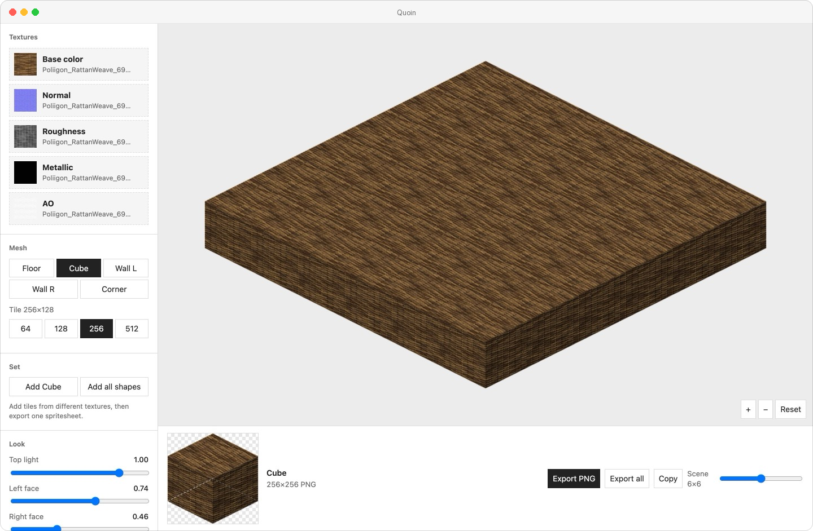
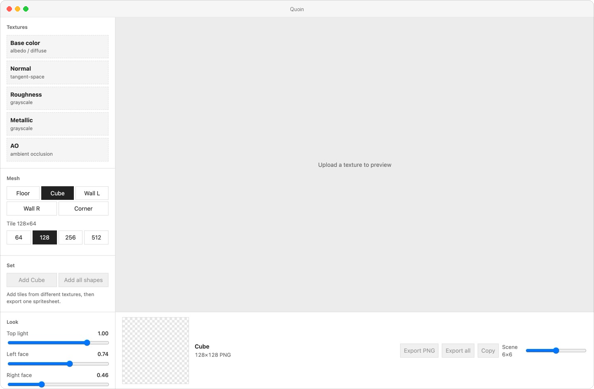
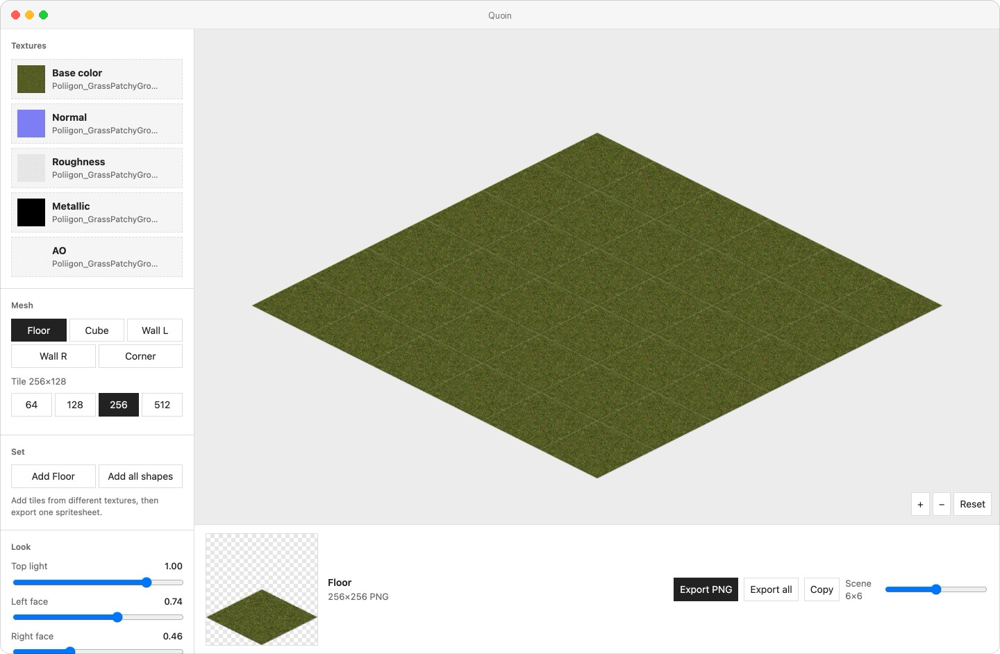
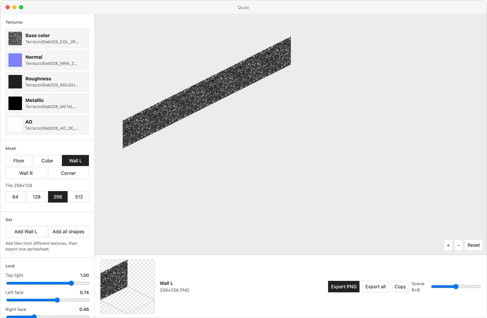
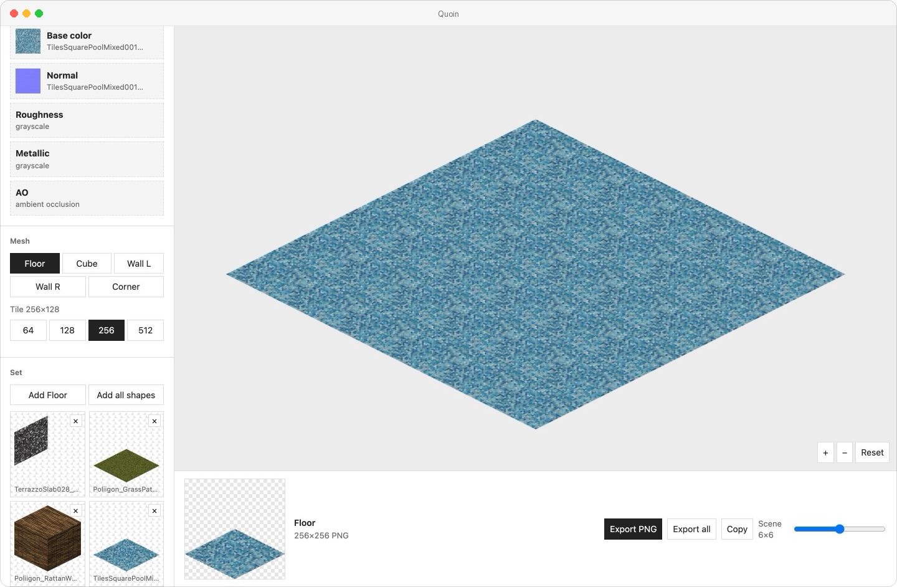

# Quoin

Bake a texture onto prerendered 2:1 isometric tiles (floors, cubes, and walls) then export PNGs for a game.

<p align="center">
  
</p>

Drop a base color, or a whole PBR set (normal, roughness, metallic, AO). Quoin maps it onto the mesh, lights the faces, and frames the PNG so floor and cube share the same grid.

## Run

```bash
npm install
npm run dev
```

Open the URL Vite prints (usually `http://localhost:5173`).

<p align="center">
  
</p>

Production:

```bash
npm run build
npm run preview
```

## Examples

### 1. Cube

1. Drop a base color (or paste an image).
2. Leave Cube selected.
3. Pick a tile size (`128` or `256` is typical).
4. Export PNG.

The PNG is `W×W` for tile width `W`. The dashed diamond on the thumbnail is the isometric cell (that is the ground footprint in Godot).

### 2. Floor plane

Select Floor and export. The diamond sits on the same cell as the cube.

<p align="center">
  
</p>

### 3. Walls

Wall L, Wall R, and Corner are the far faces of that same cell.

<p align="center">
  
</p>

### 4. PBR maps

Click a slot and pick one image for it ( can do base color, then normal, roughness, metallic, and AO).

### 5. Tile set and atlas

Bake one material, click Add all shapes, load another texture, add those tiles too, then Export atlas.

<p align="center">
  
</p>

| Button | Result |
| --- | --- |
| **Export PNG** | The selected mesh |
| **Export all** | Floor, cube, wall L, wall R, and corner in one sheet |
| **Export atlas** | Every tile currently in the set |

## Godot 4

For a 256 tile (PNG `256×256`):

1. TileSet -> Tile Shape Isometric, Layout Diamond Down
2. Tile Size 256 x 128 (height is 1/2 width)
3. Atlas Texture Region Size 256 x 256 (the PNG, not the diamond)
4. Each tile -> Texture Origin (0, 64)

Same pattern for other sizes: tile size is `W x W/2`, region is the PNG (`W x W`), origin is `(0, W/4)`.